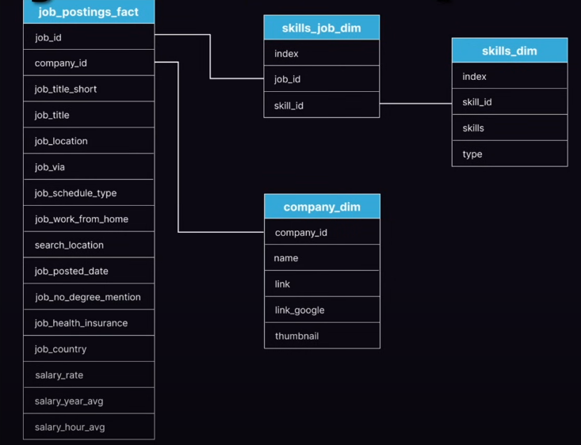

# Data Science Job Postings 2023

## ERD - Entity Relationship Diagram  

### 4 Major Tables:
1. **job_postings_fact**  
   → Fact table containing all job postings

2 & 3. **Dimension tables: skills required**
   - skill_job_dim  
   - skills_dim

4. **Dimension table: different companies posting**
   - company_dim

---

## Fact Tables:
- Core data for business analysis  
- Measure & record business events  
- Usually high volume  
- **Exists key → dimension table**